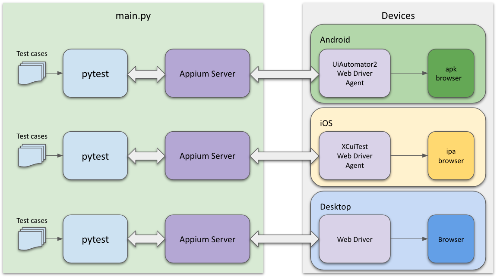

# Architecture


# Environment Setup

### Requirements
*  Required
    *  Python 3.8+
    *  Appium
    *  Appium GUI Server

*  Android
    *  ADB Tool
    *  Java Runtime (openjdk)
*  iOS
    *  Xcode
*  Optional
    *  pipenv
    *  Visual Studio Code

### Install Python3
```
Refer to https://opensource.com/article/19/5/python-3-default-mac
```

### Install all dependencies
```
brew install pipenv
pipenv sync
pip install -r requirements.txt
```
### Setup virtual environment for runtime
```
pipenv shell
pip install pytest
pip install appium-python-client
pip install pytest-html
pip install pytest-testrail
```

### Setup Appium
```
curl -o- https://raw.githubusercontent.com/nvm-sh/nvm/v0.36.0/install.sh | bash
nvm install lts
npm install -g appium
```

### Setup Appium GUI Server
```
Step1. Download : https://github.com/appium/appium-desktop
Step2. Open Appium.app
Step3. Start Servre
```

### Setup Android Device Environment
Install ADB tool and configure ANDROID_HOME for adb
```
brew cask install android-platform-tools
export ANDROID_HOME=/usr/local/bin
```

Install OpenJava and configure JAVA_HOME
```
brew tap adoptopenjdk/openjdk
brew cask install adoptopenjdk8
export JAVA_HOME=/Library/Java/JavaVirtualMachines/adoptopenjdk-8.jdk/Contents/Home
```

### Setup iOS Device Environment
Install Xcode command line tool
```
xcode-select --install 
sudo xcode-select -switch /Applications/Xcode.app/Contents/Developer 
```

Install libimobiledevice
```
brew install libimobiledevice --HEAD
```

Install ideviceinstaller
```
brew install ideviceinstaller
```

Install  ios-deploy
```
npm install -g ios-deploy
```

Install Carthage
```
brew install carthage
```

Set up the WebDriverAgent.xcodeproj file and build WebDriverAgent.xcodeproj on the iPhone device

# Run Tests
### Run all test
```
python main.py
```

### Run with specified tests
```
python main.py -q tests/test_android.py
```

### Run Android tests
```
python main.py --app=com.kkstream.android.ottfs.playerservice/main.MainActivity --platform=android
```
```
# specify test case and device
python main.py --app=com.kkstream.android.ottfs.playerservice/main.MainActivity --platform=android tests/test_android.py --device-id="udid"
python main.py --app=com.kkstream.android.ottfs.playerservice/main.MainActivity --platform=android tests/test_android.py::test_next_previous_pause --device-id="udid"
```

### Run iOS tests
```
python main.py --app=KKStream.KKSPaaSSample --platform=ios
```
```
# specify test case and device
python main.py --app=KKStream.KKSPaaSSample --platform=ios tests/test_ios.py --device-id="udid"
python main.py --app=KKStream.KKSPaaSSample --platform=ios tests/test_ios.py::test_series_content_ui --device-id="udid"
```

# TestRail Integration
```
python main.py --testrail --tr-config=conf/testrail.cfg --test-run-project-id=24 --tr-testrun-suite-id=2542 --tr-testrun-name="My test run"
```

# Folder structore
* drivers
* pages
* tests
* utils# KKS_playcraft_automation
